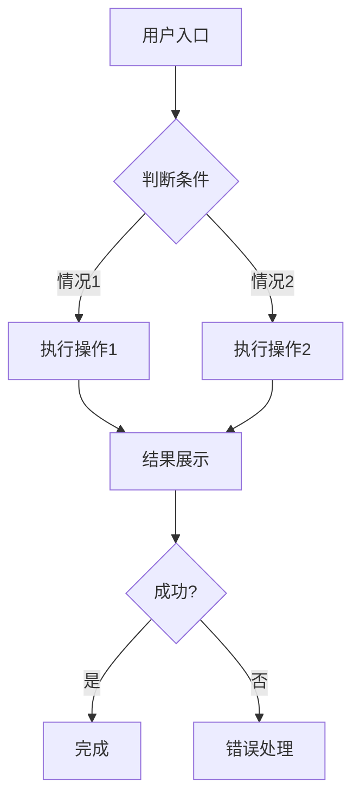

# PRD Template - 产品需求文档标准模板

产品经理编写 PRD 的统一标准，涵盖从零生成和优化现有文档两种场景。

**默认用中文输出。包含大厂级检查清单、完整异常流程、优先级标注。**

---

## 使用场景

| 场景 | 触发方式 |
|------|----------|
| 从零生成 PRD | 提供产品/功能描述，要求生成完整文档 |
| 优化现有 PRD | 提供草稿，要求补全缺失项和异常流程 |
| 检查 PRD 完整性 | 给出清单，逐项检查 |

---

## 工作流程

### 场景1：从零生成

**第一步：收集信息**
如果信息不完整，先询问：
1. 产品/功能名称是什么？
2. 目标用户是谁？
3. 核心功能点有哪些？
4. 有什么特殊限制或技术约束？

**第二步：生成 PRD**
按下方模板结构输出，确保覆盖所有章节。

### 场景2：优化现有 PRD

**第一步：检查完整性**
对照「PRD 标准检查清单」，标记缺失项。

**第二步：补全内容**
- 补充缺失章节
- 自动补全异常流程
- 完善边界条件

**第三步：输出**
用 `[新增]` 标注补充内容，给出优化摘要。

---

## PRD 标准结构

```
# [产品/功能名称] 产品需求文档

## 文档信息
- 版本：v1.0
- 日期：YYYY-MM-DD
- 状态：草稿 / 评审中 / 已确认
- 作者：[姓名]
- 变更记录：
  - v1.0 [日期] [描述]

---

## 1. 背景与目标

### 1.1 项目背景
[描述业务背景、当前痛点、为什么要做这个功能]

### 1.2 产品目标
- 用户目标：[用户想达成什么]
- 业务目标：[产品/公司想达成什么]
- 成功指标（北极星指标）：[可量化的 KPI，必须具体数字]

### 1.3 成功指标定义
| 指标名称 | 计算方式 | 目标值 | 衡量周期 |
|---------|---------|--------|---------|
| [指标1] | [计算公式] | [具体数字] | [日/周/月] |

---

## 2. 用户分析

### 2.1 目标用户
| 用户类型 | 特征描述 | 核心诉求 |
|---------|---------|---------|
| [主要用户] | [年龄/职业/使用场景] | [诉求] |
| [次要用户] | [特征] | [诉求] |

### 2.2 用户故事
- 作为 [用户角色]，我希望 [功能描述]，以便 [价值收益]
- 作为 [用户角色]，我希望 [功能描述]，以便 [价值收益]

### 2.3 用户旅程地图
[用户从发现 → 使用 → 完成目标的完整路径，标注关键触点]

---

## 3. 功能需求

### 3.1 功能清单
| 优先级 | 功能模块 | 功能描述 | 验收标准 |
|-------|---------|---------|---------|
| P0 | [核心功能] | [描述] | [可验证的标准] |
| P1 | [重要功能] | [描述] | [可验证的标准] |
| P2 | [优化功能] | [描述] | [可验证的标准] |

### 3.2 功能详细说明

#### P0 功能1：[功能名称]
- 功能描述：[做什么]
- 用户入口：[从哪进入]
- 交互逻辑：[操作步骤]
- 数据来源：[依赖的数据/接口]
- 边界条件：[数量限制、权限限制等]

#### P0 功能2：[功能名称]
[同上结构]

### 3.3 业务流程图


### 3.4 异常流程（必须覆盖）

#### 网络类异常
| 场景 | 触发条件 | 处理方式 | 用户提示 |
|-----|---------|---------|---------|
| 请求超时 | 接口 > 5s 无响应 | 展示 loading，超时后 toast | "网络开小差了，请重试" |
| 断网 | 无网络连接 | 检测到断网立即提示 | "请检查网络连接" |
| 服务端错误 | 5xx 错误 | 展示错误页，提供重试 | "服务异常，请稍后重试" |
| 请求失败 | 4xx 错误 | 根据错误码提示 | [根据具体错误] |

#### 数据类异常
| 场景 | 触发条件 | 处理方式 | 用户提示 |
|-----|---------|---------|---------|
| 列表为空 | 接口返回空数据 | 展示空状态图 + 引导 | "暂无数据，去看看其他内容" |
| 数据加载失败 | 接口返回错误 | 展示错误态 + 重试按钮 | "加载失败，点击重试" |
| 数据格式异常 | 字段缺失/类型错误 | 降级展示/兜底默认值 | [不打扰用户] |
| 数据部分加载 | 接口返回部分数据 | 展示可用数据 + 提示 | "部分数据加载成功" |

#### 权限类异常
| 场景 | 触发条件 | 处理方式 | 用户提示 |
|-----|---------|---------|---------|
| 未登录 | token 失效/未登录 | 跳转登录页，登录后回跳 | "请先登录" |
| 无权限 | 用户角色不满足 | 展示无权限页，说明原因 | "您暂无此功能权限" |
| 账号异常 | 封禁/注销 | 提示账号状态，引导客服 | "账号状态异常，联系客服" |
| 认证过期 | token 过期 | 自动刷新，刷新失败跳转登录 | [静默处理] |

#### 业务逻辑异常
| 场景 | 触发条件 | 处理方式 | 用户提示 |
|-----|---------|---------|---------|
| 业务规则不符 | 条件不满足 | 提示具体原因 | "不满足参与条件：XXX" |
| 次数限制 | 超过操作次数 | 禁止操作，提示限制 | "今日操作次数已用完" |
| 并发冲突 | 数据被其他用户修改 | 提示最新数据，引导刷新 | "数据已更新，请刷新" |

---

## 4. 非功能需求

### 4.1 性能要求
| 指标 | 要求 |
|-----|------|
| 页面加载时间 | < 2s |
| 接口响应时间 | < 500ms |
| 并发量支持 | [具体数字] |

### 4.2 安全要求
- 数据加密：[传输/存储]
- 权限控制：[功能级/数据级]
- 敏感信息：[脱敏要求]

### 4.3 兼容性要求
- 支持的系统版本：[iOS X+ / Android X+]
- 支持的设备：[机型列表]
- 屏幕适配：[尺寸范围]

### 4.4 数据埋点
| 事件名称 | 触发时机 | 上报参数 |
|---------|---------|---------|
| [事件1] | [时机] | [参数] |
| [事件2] | [时机] | [参数] |

---


---

## 5. 风险与依赖

### 5.1 风险评估
| 风险 | 概率 | 影响 | 应对措施 |
|-----|------|------|---------|
| [风险1] | 高/中/低 | 高/中/低 | [措施] |

### 5.2 依赖项
| 依赖方 | 依赖内容 | 交付时间 |
|-------|---------|---------|
| [团队1] | [内容] | [日期] |
| [系统X] | [接口/数据] | [日期] |

---

## 6. 附录

### 6.1 相关文档
- 产品原型：[链接]
- 技术方案：[链接]
- 测试用例：[链接]

### 6.2 评审记录
| 日期 | 评审人 | 结论 | 备注 |
|-----|-------|------|------|
| [日期] | [姓名] | 通过/需修改 | [备注] |
```

---

## PRD 标准检查清单

生成或优化 PRD 时，必须覆盖以下全部项：

### 必备要素
- [ ] 文档版本与变更记录
- [ ] 明确的需求背景（Why）
- [ ] **可量化的成功指标**（必须有具体数字）
- [ ] 用户画像/目标用户群
- [ ] 完整的用户旅程地图
- [ ] 核心功能详细说明（含边界条件）
- [ ] **完整的异常流程**（网络+数据+权限+业务）
- [ ] 交互原型说明或线框图描述
- [ ] 数据埋点需求
- [ ] 灰度/上线策略
- [ ] 回滚方案

### 输出标准
- [ ] 优先级用 P0/P1/P2 标注
- [ ] 异常流程包含网络错误、数据为空、权限不足三种基础场景
- [ ] 成功指标必须可量化，避免"提升用户体验"这种模糊描述
- [ ] 每个 P0 功能有明确的验收标准

---

## 常见问题

**Q: 用户只给了简单描述怎么办？**
A: 先询问关键信息：目标用户、核心功能，成功指标。不要生成缺少这些基础的 PRD。

**Q: 异常流程怎么写更完整？**
A: 按「网络类 → 数据类 → 权限类 → 业务逻辑」四层排查，每层都要有场景、处理方式、用户提示。

**Q: 成功指标怎么量化？**
A: 避免"提升用户体验"，改为"日活提升 10%"、"转化率从 5% 提升到 5%"。